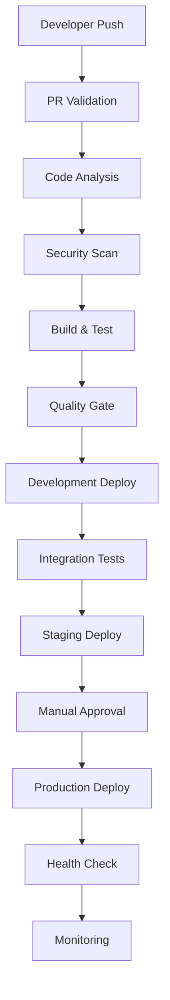

# 🚀 ShopFlow CI/CD Pipeline Documentation

## 📋 Table of Contents

1. [Overview](#overview)
2. [Pipeline Architecture](#pipeline-architecture)
3. [Workflows](#workflows)
4. [Security & Quality Gates](#security--quality-gates)
5. [Monitoring & Alerting](#monitoring--alerting)
6. [Deployment Strategy](#deployment-strategy)
7. [Getting Started](#getting-started)
8. [Troubleshooting](#troubleshooting)

## 🎯 Overview

The ShopFlow CI/CD pipeline is designed with security, reliability, and scalability in mind. It provides:

- **Automated Testing**: 352 comprehensive unit tests with 95%+ coverage
- **Security Scanning**: CodeQL, Snyk, and Trivy security analysis
- **Multi-Environment Deployment**: Development, Staging, and Production
- **Monitoring Stack**: Prometheus, Grafana, and ELK stack
- **Quality Gates**: Automated quality checks and manual approval processes

## 🏗️ Pipeline Architecture



## 🔄 Workflows

### 1. **Main CI Pipeline** (`.github/workflows/ci.yml`)

**Triggers:**

- Push to `main` branch
- Pull request to `main` branch
- Manual dispatch

**Jobs:**

1. **Code Analysis** - CodeQL security scanning
2. **Build** - Multi-platform .NET build
3. **Test** - Run all 352 tests with coverage reporting
4. **Security** - Snyk vulnerability scanning
5. **Quality Gate** - Enforce quality standards
6. **Deploy Dev** - Automatic deployment to development

### 2. **PR Validation** (`.github/workflows/pr-validation.yml`)

**Triggers:**

- Pull request events (opened, synchronize, reopened)

**Jobs:**

1. **PR Validation** - Fast feedback for PRs
2. **Detailed Analysis** - Comprehensive analysis for important PRs
3. **Security Check** - GitLeaks and Trivy scanning

### 3. **Deployment Pipeline** (`.github/workflows/deploy.yml`)

**Triggers:**

- Workflow dispatch
- Successful CI completion

**Jobs:**

1. **Build & Push** - Docker image creation and registry push
2. **Deploy Development** - Automatic deployment
3. **Deploy Staging** - Automated with health checks
4. **Deploy Production** - Manual approval required

### 4. **Maintenance & Monitoring** (`.github/workflows/maintenance.yml`)

**Triggers:**

- Daily schedule (2 AM UTC)
- Weekly schedule (Sunday 4 AM UTC)
- Manual dispatch

**Jobs:**

1. **Dependency Check** - Vulnerability and outdated package scanning
2. **Performance Monitoring** - Load testing and performance metrics
3. **Cleanup** - Artifact and cache cleanup
4. **Health Check** - Environment health monitoring
5. **Weekly Reports** - Automated summary generation

## 🔒 Security & Quality Gates

### Security Measures

- **CodeQL Analysis**: Static code analysis for security vulnerabilities
- **Snyk Scanning**: Dependency vulnerability scanning
- **Trivy**: Container image vulnerability scanning
- **GitLeaks**: Secret scanning in code
- **OWASP Dependency Check**: Software composition analysis

### Quality Gates

- **Test Coverage**: Minimum 95% code coverage required
- **Build Success**: All builds must pass across platforms
- **Security Pass**: No critical security vulnerabilities allowed
- **Performance**: Response time thresholds enforced
- **Manual Approval**: Production deployments require approval

## 📊 Monitoring & Alerting

### Monitoring Stack

- **Prometheus**: Metrics collection and storage
- **Grafana**: Visualization and dashboards
- **AlertManager**: Alert routing and notification
- **ELK Stack**: Log aggregation and analysis
- **Jaeger**: Distributed tracing

### Key Metrics

- **Application Performance**: Response time, throughput, error rate
- **Infrastructure**: CPU, memory, disk usage
- **Business Metrics**: User registrations, orders, revenue
- **Security**: Failed authentication attempts, suspicious activities

### Alerting Rules

- **Critical**: Service down, high error rate, security breaches
- **Warning**: High response time, resource usage, failed builds
- **Info**: Low activity, maintenance notifications

## 🚀 Deployment Strategy

### Blue-Green Deployment

1. **Build Phase**: Create new version (Green)
2. **Test Phase**: Comprehensive testing on Green environment
3. **Switch Phase**: Route traffic from Blue to Green
4. **Verification**: Monitor Green environment
5. **Cleanup**: Keep Blue as rollback option

### Environment Strategy

- **Development**: Automatic deployment on every commit
- **Staging**: Automatic deployment after successful development tests
- **Production**: Manual approval with comprehensive health checks

## 🎉 Getting Started

### Prerequisites

1. **GitHub Repository**: Access to ShopFlow repository
2. **AWS Account**: EKS cluster for Kubernetes deployments
3. **Container Registry**: Docker Hub or AWS ECR access
4. **Secrets Configuration**: Required environment variables

### Initial Setup

1. **Configure Secrets**:

   ```bash
   # GitHub Secrets
   DOCKERHUB_USERNAME
   DOCKERHUB_TOKEN
   AWS_ACCESS_KEY_ID
   AWS_SECRET_ACCESS_KEY
   SNYK_TOKEN
   SLACK_WEBHOOK_URL
   ```

2. **Deploy Infrastructure**:

   ```bash
   # Create Kubernetes namespaces
   kubectl apply -f k8s/namespaces/

   # Deploy ConfigMaps and Secrets
   kubectl apply -f k8s/configmaps/

   # Deploy applications
   kubectl apply -f k8s/deployments/
   kubectl apply -f k8s/services/
   ```

3. **Start Monitoring**:

   ```bash
   # Start monitoring stack
   docker-compose -f docker-compose.monitoring.yml up -d

   # Access dashboards
   # Grafana: http://localhost:3000 (admin/admin123)
   # Prometheus: http://localhost:9090
   # AlertManager: http://localhost:9093
   ```

### First Deployment

1. **Create Feature Branch**:

   ```bash
   git checkout -b feature/your-feature
   git push origin feature/your-feature
   ```

2. **Create Pull Request**: PR validation will run automatically

3. **Merge to Main**: CI pipeline will deploy to development

4. **Promote to Staging**: Use manual workflow dispatch

5. **Deploy to Production**: Requires manual approval

## 🔧 Troubleshooting

### Common Issues

#### 1. **Build Failures**

**Symptoms**: Build job fails in CI pipeline
**Solutions**:

- Check build logs in GitHub Actions
- Verify .NET version compatibility
- Ensure all dependencies are available
- Check for syntax errors or missing references

#### 2. **Test Failures**

**Symptoms**: Test job fails with specific test failures
**Solutions**:

- Run tests locally: `dotnet test`
- Check test logs for specific failures
- Verify test data and mocking setup
- Ensure database connections for integration tests

#### 3. **Security Scan Failures**

**Symptoms**: Security job fails with vulnerabilities
**Solutions**:

- Review Snyk/CodeQL reports
- Update vulnerable dependencies
- Fix identified security issues
- Add security exceptions for false positives

#### 4. **Deployment Failures**

**Symptoms**: Deployment fails to target environment
**Solutions**:

- Check Kubernetes cluster status
- Verify secrets and ConfigMaps
- Check resource availability
- Review deployment logs

#### 5. **Health Check Failures**

**Symptoms**: Application fails health checks
**Solutions**:

- Check application logs
- Verify database connectivity
- Check external service dependencies
- Review resource limits

### Debug Commands

```bash
# Check workflow status
gh workflow list
gh workflow view ci.yml

# View logs
gh run list
gh run view <run-id>

# Kubernetes debugging
kubectl get pods -n shopflow-production
kubectl logs -f deployment/shopflow-api -n shopflow-production
kubectl describe pod <pod-name> -n shopflow-production

# Docker debugging
docker logs shopflow-api
docker exec -it shopflow-api /bin/bash

# Monitoring checks
curl http://localhost:9090/targets  # Prometheus targets
curl http://localhost:3000/api/health  # Grafana health
```

### Emergency Procedures

#### 1. **Rollback Production Deployment**

```bash
# Rollback to previous version
kubectl rollout undo deployment/shopflow-api -n shopflow-production

# Check rollback status
kubectl rollout status deployment/shopflow-api -n shopflow-production
```

#### 2. **Scale Application**

```bash
# Scale up for high traffic
kubectl scale deployment shopflow-api --replicas=5 -n shopflow-production

# Scale down to save resources
kubectl scale deployment shopflow-api --replicas=1 -n shopflow-production
```

#### 3. **Emergency Maintenance Mode**

```bash
# Deploy maintenance page
kubectl apply -f k8s/maintenance/maintenance-mode.yml

# Remove maintenance mode
kubectl delete -f k8s/maintenance/maintenance-mode.yml
```

## 📞 Support

### Contacts

- **DevOps Team**: devops@shopflow.com
- **Security Team**: security@shopflow.com
- **Development Team**: dev@shopflow.com

### Monitoring Dashboards

- **Grafana**: https://monitoring.shopflow.com
- **Prometheus**: https://prometheus.shopflow.com
- **Kibana**: https://logs.shopflow.com
- **Jaeger**: https://tracing.shopflow.com

### Documentation Links

- [API Documentation](https://api.shopflow.com/swagger)
- [Architecture Guide](./ARCHITECTURE.md)
- [Security Policies](./SECURITY.md)
- [Runbook](./RUNBOOK.md)

---

**Last Updated**: December 2024  
**Version**: 1.0  
**Maintained by**: ShopFlow DevOps Team
